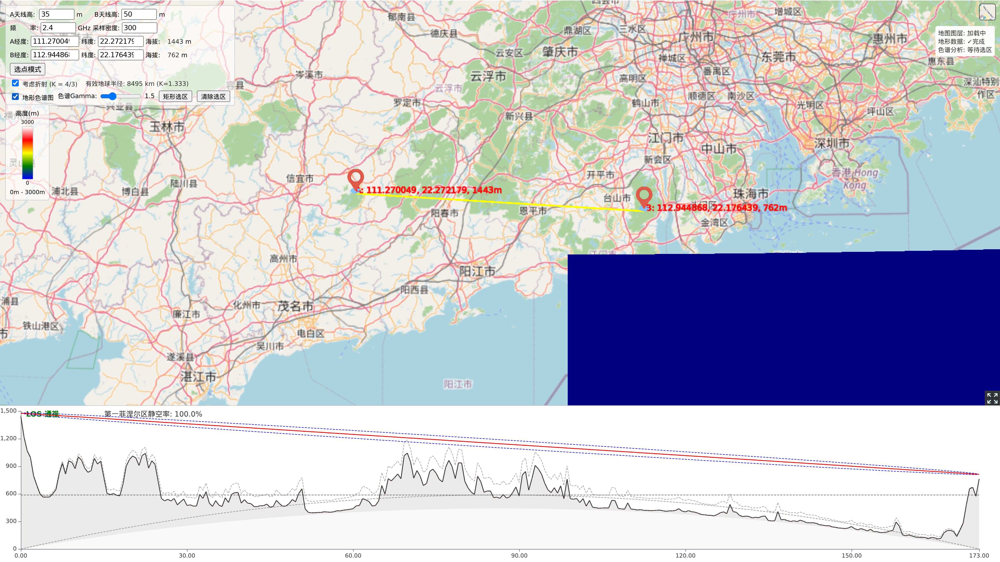

# Terrain RF Profiler — 地形射频通视分析

> **RF Line-of-Sight / 地形通视分析** — A single-page 3D terrain analysis tool built with CesiumJS + ECharts.  
> 基于 CesiumJS + ECharts 的单页 3D 地形射频通视分析工具。

[](https://cesium.com)
[](https://echarts.apache.org)
[](LICENSE)

---

## 目录 | Table of Contents

- [功能概览 | Features](#功能概览--features)
- [灵感来源 | Inspiration](#灵感来源--inspiration)
- [快速开始 | Quick Start](#快速开始--quick-start)
- [使用说明 | Usage Guide](#使用说明--usage-guide)
  - [1. 默认界面 | Default Interface](#1-默认界面--default-interface)
  - [2. 调节天线高度与频率 | Adjust Antenna & Frequency](#2-调节天线高度与频率--adjust-antenna--frequency)
  - [3. 空气折射 (K 因子) | Atmospheric Refraction](#3-空气折射-k-因子--atmospheric-refraction)
  - [4. 切换卫星图底图 | Switch to Satellite Imagery](#4-切换卫星图底图--switch-to-satellite-imagery)
  - [5. 选点模式 | Point Picking Mode](#5-选点模式--point-picking-mode)
  - [6. 地形色谱图（等待选区）| Elevation Ramp (Awaiting Selection)](#6-地形色谱图等待选区--elevation-ramp-awaiting-selection)
  - [7. 矩形选区与色谱着色 | Rectangle Selection & Chromatogram](#7-矩形选区与色谱着色--rectangle-selection--chromatogram)
  - [8. 图表光标同步 | Chart Hover Sync](#8-图表光标同步--chart-hover-sync)
- [控制面板总览 | Control Panel Overview](#控制面板总览--control-panel-overview)
- [技术细节 | Technical Details](#技术细节--technical-details)

---

## 功能概览 | Features

| 功能 | 说明 |
|------|------|
| **A/B 标记点** | 两个可拖动的靶标标记点，实时显示经纬度与海拔 |
| **路径分析图** | 地形截面、LOS 视线、菲涅尔区、阻挡点、0 海拔线、K=1 对比线 |
| **天线高度** | 分别设置 A/B 两点天线高度 (0–6000m) |
| **频率设置** | 调整工作频率，菲涅尔区半径自动重算 |
| **空气折射** | K=4/3 地球曲率修正，图表显示对比参考线 |
| **底图切换** | OpenStreetMap ↔ ArcGIS 全球卫星影像 |
| **选点模式** | 点击地图直接选取 A/B 位置 |
| **地形色谱图** | 3D 球面地形高度伪彩色着色，可调节 Gamma |
| **矩形选区** | 在地图上划定色谱分析区域 |
| **光标同步** | 图表悬停时 3D 场景对应位置红色标记联动 |

| Feature | Description |
|---------|-------------|
| **A/B Markers** | Two draggable target markers showing real-time lat/lon & elevation |
| **Profile Chart** | Terrain section, LOS line, Fresnel zone, block points, zero-altitude line, K=1 reference |
| **Antenna Height** | Independent height setting for each endpoint (0–6000m) |
| **Frequency** | Adjust operating frequency; Fresnel radius recalculated automatically |
| **Refraction** | K=4/3 Earth curvature correction with comparison reference line |
| **Base Map** | Toggle between OpenStreetMap and ArcGIS World Imagery |
| **Pick Mode** | Click directly on the globe to set A/B points |
| **Elevation Ramp** | Pseudo-color elevation overlay on the 3D globe, with Gamma control |
| **Rectangular Selection** | Draw a region on the map for chromatogram analysis |
| **Hover Sync** | Hover on chart → red dot follows on the 3D scene |

## 灵感来源 | Inspiration

**中文**  
本工具的功能设计参考了 [HeyWhatsThat Path Profiler](https://heywhatsthat.com/profiler.html) 和 **Google Earth** 的地形剖面功能，并在此基础上增加了 **3D 地形色谱图** —— 通过伪彩色着色在球面上直观展示地形高度分布，方便快速分析选点。与此同时，本工具将射频通视分析（LOS、菲涅尔区、K 因子空气折射）与 3D 地理场景深度集成，为无线链路规划提供一站式可视化支撑。

**English**  
This tool's feature design draws inspiration from the [HeyWhatsThat Path Profiler](https://heywhatsthat.com/profiler.html) and **Google Earth**'s terrain profile capabilities. On top of that, it adds a **3D elevation chromatogram** — a pseudo-color overlay on the globe that visualizes terrain height distribution for rapid site selection. It also deeply integrates RF line-of-sight analysis (LOS, Fresnel zones, K-factor refraction) with the 3D geospatial scene, providing an all-in-one visualization tool for wireless link planning.

---

## 快速开始 | Quick Start

**Open directly / 直接打开**

Just open `index.html` in a browser (requires internet for CesiumJS, ECharts, and terrain tiles).  
直接在浏览器中打开 `index.html` 即可（需要联网加载 CesiumJS、ECharts 及地形瓦片）。

```bash
# Or serve locally / 或本地启动服务
python3 -m http.server 8080
# → http://localhost:8080
```

---

## 使用说明 | Usage Guide

### 1. 默认界面 | Default Interface


**中文**  
页面加载后，自动在广东沿海（A: 111.27°E, 22.27°N / B: 112.94°E, 22.18°N）生成两点，并采样地形绘制截面分析图。上方为 3D 地球场景，下方为 ECharts 路径分析图表。

**English**  
On load, the app places two default markers near the Guangdong coast and samples terrain to draw the profile chart. The 3D globe occupies the upper area; the ECharts profile chart sits at the bottom.

---

### 2. 调节天线高度与频率 | Adjust Antenna & Frequency


**中文**  
左侧控制面板可分别设置 A/B 天线高度（单位 m）和工作频率（单位 GHz）。调整后路径分析图自动重绘：天线高度影响 LOS 视线高度，频率影响菲涅尔区半径。

**English**  
The left control panel allows independent antenna height (meters) and frequency (GHz) settings. Changes trigger an automatic chart refresh: antenna height shifts the LOS line, while frequency adjusts the Fresnel zone radius.

---

### 3. 空气折射 (K 因子) | Atmospheric Refraction


**中文**  
勾选 **"考虑折射 (K=4/3)"** 后，地球曲率将按等效地球半径（~8493 km）计算。图表中：
- 地形/曲率线按 K=4/3 修正隆起
- 灰色虚线为 K=1（无折射）对比参考线
- 状态栏显示有效地球半径值

**English**  
Check **"考虑折射 (K=4/3)"** to apply the effective Earth radius (~8493 km) for curvature correction. The chart shows:
- Terrain/curvature lines corrected for K=4/3
- A gray dashed K=1 (no refraction) reference line
- Effective radius displayed in the status bar

---

### 4. 切换卫星图底图 | Switch to Satellite Imagery


**中文**  
点击右上角 **图层切换按钮**，可在 OpenStreetMap 与 ArcGIS 全球卫星影像之间切换。标记颜色自动适配浅色/深色底图。

**English**  
Click the **layer switcher** (top-right) to toggle between OpenStreetMap and ArcGIS World Imagery. Marker colors adapt automatically to the base map.

---

### 5. 选点模式 | Point Picking Mode


**中文**  
点击 **"选点模式"** 按钮，按钮变为"点击地图选 A/B"。依次点击地图上两个位置，分别设定 A 点和 B 点。完成后自动跳转、采样并绘制分析图。

**English**  
Click **"选点模式"** (Pick Mode). The button changes to "点击地图选 A/B". Click two locations on the globe to set points A and B. The app then auto-flies, samples terrain, and draws the profile.

---

### 6. 地形色谱图（等待选区）| Elevation Ramp (Awaiting Selection)



**中文**  
勾选 **"地形色谱图"** 后，顶部出现 Gamma 滑块和选区控制。此时因尚未划定选区，状态栏显示 **"等待选区"**，3D 场景暂无色谱覆盖。

**English**  
Check **"地形色谱图"** (Elevation Ramp). The Gamma slider and selection controls appear. Without a selection region, the status bar shows **"等待选区"** (Awaiting Selection) and no color overlay is applied.

---

### 7. 矩形选区与色谱着色 | Rectangle Selection & Chromatogram


**中文**  
点击 **"矩形选区"** 按钮进入选区模式，在地图上拖拽画出矩形区域。松开后：
- 3D 球面按地形高度着色（蓝→绿→黄→红→白）
- 左上方显示色谱图例
- 状态栏显示采样进度和完成状态
- 可通过 **Gamma 滑块** 调节颜色分布的非线性度

**English**  
Click **"矩形选区"** (Rectangle Select) to enter selection mode, then drag on the globe to draw a rectangle. On release:
- The 3D globe is colorized by elevation (blue→green→yellow→red→white)
- A color legend appears top-left
- The status bar shows sampling progress and completion
- Use the **Gamma slider** to adjust color distribution nonlinearity

---

### 8. 图表光标同步 | Chart Hover Sync


**中文**  
鼠标悬停在下方分析图上时，3D 场景中对应位置会显示一个**红色圆点**，方便在地球上定位当前查看的截面位置。

**English**  
Hover over the profile chart and a **red dot** appears on the 3D globe at the corresponding position — making it easy to locate the cross-section point on the map.

---

### 控制面板总览 | Control Panel Overview


**中文**  
左侧控制面板包含了所有操作入口，从上到下依次为：
1. **A/B 天线高度** — 输入数值 (0–6000 m)
2. **频率 & 采样密度** — 工作频率 (0.1–100 GHz) 与路径采样点数
3. **A/B 坐标** — 经纬度手动输入，支持实时编辑
4. **选点模式** — 切换到地图点击选点
5. **空气折射** — K=4/3 复选框
6. **地形色谱** — 主开关 + Gamma 调节 + 矩形选区/清除

**English**  
All controls are grouped in the left panel, top to bottom:
1. **Antenna Heights A/B** — numeric input (0–6000 m)
2. **Frequency & Sampling Density** — operating frequency (0.1–100 GHz) and path sample count
3. **A/B Coordinates** — manual lat/lon with real-time editing
4. **Pick Mode** — switch to globe click-selection
5. **Refraction** — K=4/3 toggle
6. **Elevation Ramp** — master toggle, Gamma adjustment, rectangle select & clear

---

## 技术细节 | Technical Details

### Stack
- **CesiumJS 1.105** — 3D globe, terrain sampling, elevation ramp material
- **ECharts 5** — interactive profile chart
- **Vanilla JS** — no framework, no bundler, single HTML file

### Key Concepts

| 概念 | 说明 |
|------|------|
| **采样** | `Cesium.sampleTerrainMostDetailed` 批量异步采样，32 点/批，15 秒超时 |
| **色谱** | 自定义 Globe Material，基于高度分段线性插色，Gamma 幂次映射 |
| **选区** | 自适应网格 (12×12 ~ 20×20)，5% 缓冲区，最小高度范围 1m |
| **菲涅尔区** | `F1 = sqrt(λ × d1 × d2 / D)`，60% 半径作为容限 |
| **K 因子** | 有效地球半径 `Re = R × K`，曲率修正 `x(D-x)/(2RK)` |

### Performance Notes
- Chromatogram sampling runs in **batches of 32** with progress updates
- Camera movement triggers **debounced** re-sampling (300ms debounce + 2s throttle)
- High-point refinement was removed to save 2–3× time in sampling
- Shader-based color mapping runs at <0.1% GPU cost (global material)

---

## License

MIT — feel free to use, modify, and share.

---

## AI 辅助创作 | AI-Assisted Creation

**中文**  
本项目由 **Opencode** ([opencode.ai](https://opencode.ai)) + AI 辅助完成。从功能开发、Bug 修复到文档编写，全程在人机协作模式下完成。

**English**  
This project was created with **Opencode** ([opencode.ai](https://opencode.ai)) + AI assistance. From feature development and bug fixes to documentation writing, the entire process was completed in a human-AI collaborative mode.
