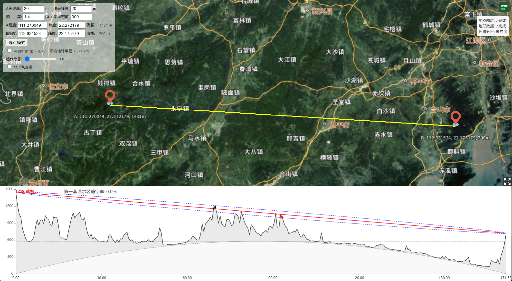
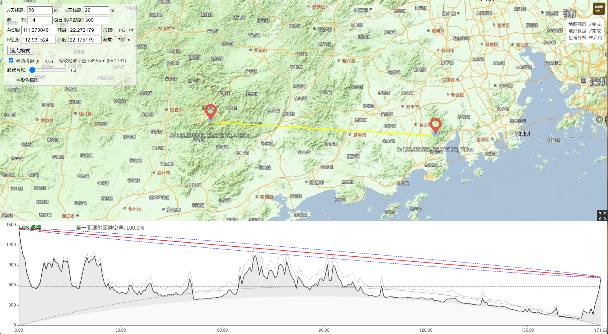
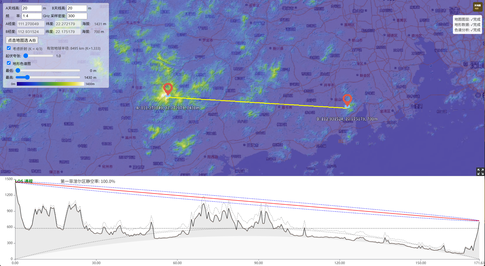
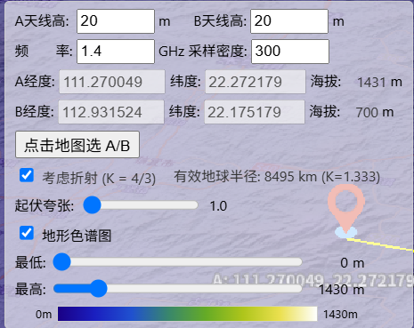
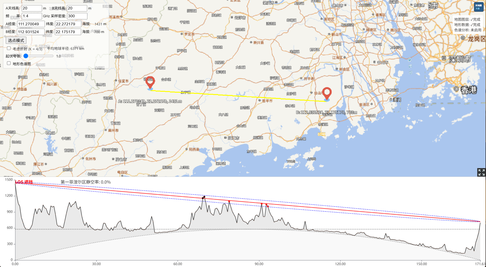
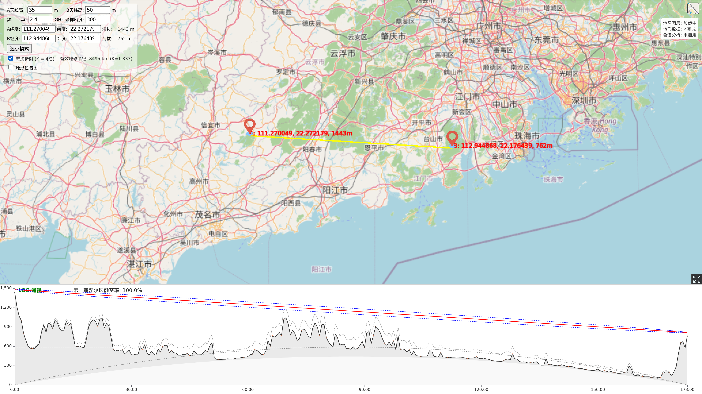
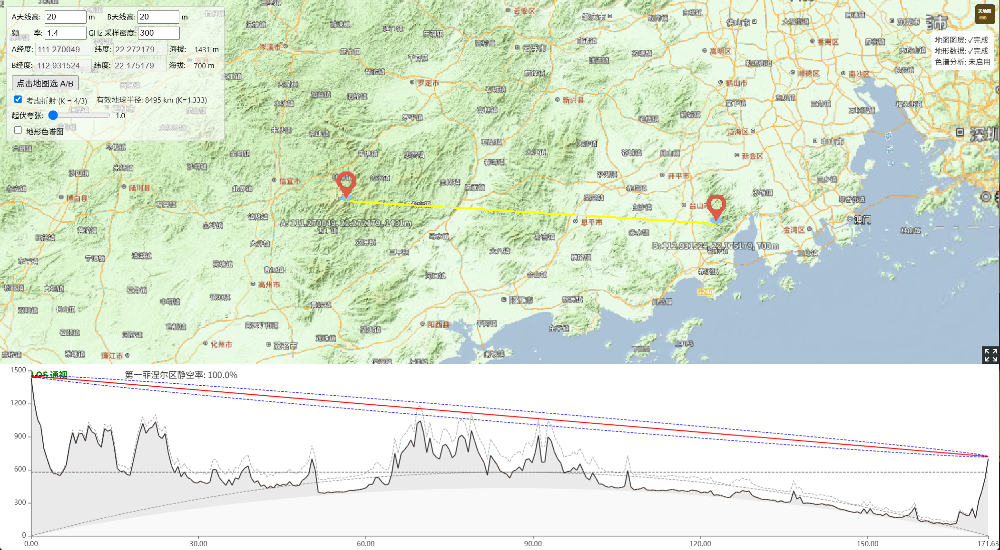
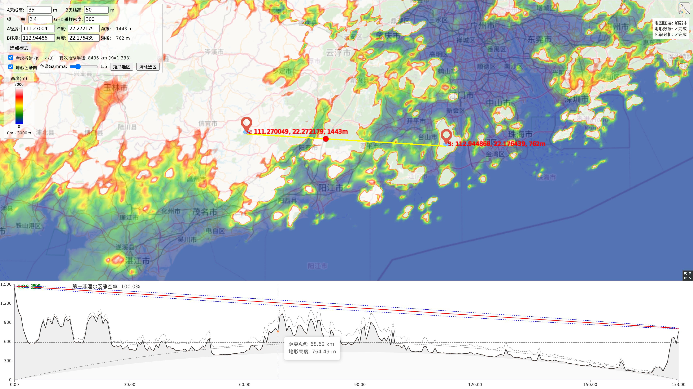

# Terrain RF Profiler — 地形射频通视分析

> **RF Line-of-Sight / 地形通视分析** — A single-page 3D terrain analysis tool built with CesiumJS + ECharts.  
> 基于 CesiumJS + ECharts 的单页 3D 地形射频通视分析工具。

[](https://cesium.com)
[](https://echarts.apache.org)
[](LICENSE)

---

## 目录 | Table of Contents

- [功能概览 | Features](#功能概览--features)
- [截图预览 | Screenshots](#截图预览--screenshots)
- [快速开始 | Quick Start](#快速开始--quick-start)
- [天地图 Key 申请 | Tianditu API Key](#天地图-key-申请--tianditu-api-key)
- [使用说明 | Usage Guide](#使用说明--usage-guide)
- [技术细节 | Technical Details](#技术细节--technical-details)

---

## 功能概览 | Features

| 功能 | 说明 |
|------|------|
| **A/B 标记点** | 两个可拖动的靶标标记点，实时显示经纬度与海拔 |
| **路径分析图** | 地形截面、LOS 视线、菲涅尔区、阻挡点、0 海拔线、K=1 对比线 |
| **天线高度** | 分别设置 A/B 两点天线高度 (0–6000m) |
| **频率设置** | 调整工作频率，菲涅尔区半径自动重算 |
| **空气折射** | K=4/3 地球曲率修正，图表显示对比参考线 |
| **起伏夸张** | 地形高度1x–5x 垂直夸张，图表同步联动 |
| **地形色谱图** | 全球范围 BGYW 伪彩色高度着色，可手动调节最低/最高海拔范围 |
| **天地图地形** | 使用天地图3D地形瓦片，中文地名标注层 |
| **3D 自由视角** | 支持自由旋转/倾斜/缩放地球场景 |
| **选点模式** | 点击地图直接选取 A/B 位置 |
| **光标同步** | 图表悬停时3D场景对应位置红色标记联动 |
| **桌面应用** | Windows x64 桌面版，离线运行 |

| Feature | Description |
|---------|-------------|
| **A/B Markers** | Two draggable target markers showing real-time lat/lon & elevation |
| **Profile Chart** | Terrain section, LOS line, Fresnel zone, block points, zero-altitude line, K=1 reference |
| **Antenna Height** | Independent height setting for each endpoint (0–6000m) |
| **Frequency** | Adjust operating frequency; Fresnel radius recalculated automatically |
| **Refraction** | K=4/3 Earth curvature correction with comparison reference line |
| **Vertical Exaggeration** | Terrain height1x–5x vertical exaggeration, synced to chart |
| **Elevation Ramp** | BGYW pseudo-color overlay across the full globe, with manual min/max elevation range |
| **Tianditu Terrain** | 3D terrain tiles from Tianditu, Chinese place name annotation layer |
| **3D Free View** | Free orbit/tilt/zoom on the globe |
| **Pick Mode** | Click directly on the globe to set A/B points |
| **Hover Sync** | Hover on chart → red dot follows on the 3D scene |
| **Desktop App** | Windows x64 standalone build, offline capable |

---

## 截图预览 | Screenshots

### 默认界面 | Default Interface


### 卫星图底图 | Satellite Imagery


### 地形色谱图 | Elevation Ramp


### 控制面板 | Control Panel


---

## 快速开始 | Quick Start

### 方式一：Windows 桌面应用（推荐）| Desktop App (Recommended)

从 [Releases](https://github.com/nicholasfox/terrain-rf-profiler/releases) 页面下载 `los.exe`，双击运行即可。无需安装，无需联网（首次使用需配置天地图 Key）。

Download `los.exe` from [Releases](https://github.com/nicholasfox/terrain-rf-profiler/releases). Double-click to run — no installation, no internet required (first use requires Tianditu key configuration).

### 方式二：浏览器直接打开 | Browser

直接在浏览器中打开 `index.html` 即可（需要联网加载天地图地形瓦片）。

Open `index.html` directly in your browser (requires internet for Tianditu terrain tiles).

```bash
# 或本地启动服务 | Or serve locally
python3 -m http.server 8080
# → http://localhost:8080
```

---

## 天地图 Key 申请 | Tianditu API Key

本工具使用 **天地图** 提供地形数据和地名标注，需要一个天地图 API Key 才能正常使用。

This tool uses **Tianditu** for terrain data and place name annotations. A Tianditu API key is required.

### 申请步骤 | How to Apply

1. 打开天地图开放平台：https://console.tianditu.gov.cn/
   Open Tianditu Console: https://console.tianditu.gov.cn/

2. 点击 **"注册"** 注册一个天地图账号（支持手机号注册）
   Click **"Register"** to create a Tianditu account (phone number supported)

3. 登录后进入控制台，点击 **"创建新应用"**
   After login, click **"Create New Application"**

4. 填写应用信息：
   Fill in the application details:
   - **应用名称**（Application Name）：任意填写，如 `RF Profiler`
   - **应用类型**（Application Type）：选择 **"浏览器端"**
   - **域名白名单**：如果是本地使用，填写 `*` 或 `localhost`

5. 点击 **"创建"**，即可获得一个 **Key**（32位字符串，如 `3434e0337ed4d651277ec7e690a61b4c`）
   Click **"Create"** to get a **Key** (32-character string)

### 配置方法 | Configuration

#### 桌面版 | Desktop App

首次运行 `los.exe` 时，程序所在目录会生成一个 `key.txt` 文件。用文本编辑器打开，将你的 Key 粘贴进去保存即可。

When you first run `los.exe`, a `key.txt` file is created in the same directory. Open it with a text editor, paste your key, and save.

```
# key.txt 内容示例 | Example key.txt content
3434e0337ed4d651277ec7e690a61b4c
```

#### 浏览器版 | Browser

在 `index.html` 中找到以下行，将 `YOUR_KEY` 替换为你的 Key：

In `index.html`, find the following line and replace `YOUR_KEY` with your key:

```javascript
const TIANDITU_KEY = localStorage.getItem('tianditu_key') || 'YOUR_KEY';
```

或者在浏览器控制台执行（会保存到 localStorage）：

Or run in browser console (saves to localStorage):

```javascript
localStorage.setItem('tianditu_key', '你的Key');
location.reload();
```

---

## 使用说明 | Usage Guide

### 1. 默认界面 | Default Interface


**中文**  
页面加载后，自动在广东沿海（A: 111.27°E, 22.27°N / B: 112.94°E, 22.18°N）生成两点，采样天地图地形绘制截面分析图。上方为3D地球场景，下方为 ECharts 路径分析图表。

**English**  
On load, the app places two default markers near the Guangdong coast, samples Tianditu terrain, and draws the profile chart. The 3D globe occupies the upper area; the ECharts profile chart sits at the bottom.

---

### 2. 调节天线高度与频率 | Adjust Antenna & Frequency



**中文**  
左侧控制面板可分别设置 A/B 天线高度（单位 m）和工作频率（单位 GHz）。调整后路径分析图自动重绘：天线高度影响 LOS 视线高度，频率影响菲涅尔区半径。

**English**  
The left control panel allows independent antenna height (meters) and frequency (GHz) settings. Changes trigger an automatic chart refresh: antenna height shifts the LOS line, while frequency adjusts the Fresnel zone radius.

---

### 3. 空气折射 (K 因子) | Atmospheric Refraction



**中文**  
勾选 **"考虑折射 (K = 4/3)"** 后，地球曲率将按等效地球半径（~8495 km）计算。图表中：
- 地形/曲率线按 K=4/3 修正隆起
- 灰色虚线为 K=1（无折射）对比参考线
- 状态栏显示有效地球半径值

**English**  
Check **"考虑折射 (K = 4/3)"** to apply the effective Earth radius (~8495 km) for curvature correction. The chart shows:
- Terrain/curvature lines corrected for K=4/3
- A gray dashed K=1 (no refraction) reference line
- Effective radius displayed in the status bar

---

### 4. 切换卫星图底图 | Switch to Satellite Imagery


**中文**  
点击右上角 **图层切换按钮**，可在天地图标准地图与卫星影像之间切换。天地图自动叠加中文地名标注层。标记颜色自动适配浅色/深色底图。

**English**  
Click the **layer switcher** (top-right) to toggle between Tianditu standard map and satellite imagery. Tianditu automatically overlays Chinese place name annotations. Marker colors adapt to the base map.

---

### 5. 选点模式 | Point Picking Mode



**中文**  
点击 **"选点模式"** 按钮，按钮变为"点击地图选 A/B"。依次点击地图上两个位置，分别设定 A 点和 B 点。完成后自动跳转、采样并绘制分析图。

**English**  
Click **"选点模式"** (Pick Mode). The button changes to "点击地图选 A/B". Click two locations on the globe to set points A and B. The app then auto-flies, samples terrain, and draws the profile.

---

### 6. 地形色谱图 | Elevation Ramp


**中文**  
勾选 **"地形色谱图"** 后，3D 地球表面按地形高度进行伪彩色着色（蓝→青→绿→黄→白，即 BGYW 色图）。左下角显示颜色图例。

通过 **最低/最高** 两个滑块可手动调节色谱的海拔映射范围：
- **最低**：色谱蓝端对应的海拔（默认0m）
- **最高**：色谱白端对应的海拔（默认1430m）

**English**  
Check **"地形色谱图"** (Elevation Ramp) to apply pseudo-color elevation overlay on the globe (blue→cyan→green→yellow→white, BGYW colormap). A color legend appears at bottom-left.

Use the **最低/最高** (min/max) sliders to adjust the elevation mapping range:
- **最低 (Min)**: Elevation for the blue end (default 0m)
- **最高 (Max)**: Elevation for the white end (default 1430m)

---

### 7. 起伏夸张 | Vertical Exaggeration

**中文**  
**起伏夸张** 滑块（1.0x–5.0x）可对地形高度进行垂直夸张，使地形起伏更加明显。调整时3D 地球场景和下方分析图表同步联动。

**English**  
The **起伏夸张** (Vertical Exaggeration) slider (1.0x–5.0x) amplifies terrain height for clearer visualization. Changes apply to both the 3D globe and the profile chart simultaneously.

---

### 8. 图表光标同步 | Chart Hover Sync



**中文**  
鼠标悬停在下方分析图上时，3D 场景中对应位置会显示一个**红色圆点**，方便在地球上定位当前查看的截面位置。

**English**  
Hover over the profile chart and a **red dot** appears on the 3D globe at the corresponding position — making it easy to locate the cross-section point on the map.

---

### 控制面板总览 | Control Panel Overview


**中文**  
左侧控制面板包含了所有操作入口，从上到下依次为：
1. **A/B 天线高度** — 输入数值 (0–6000 m)
2. **频率 & 采样密度** — 工作频率 (0.1–100 GHz) 与路径采样点数
3. **A/B 坐标** — 经纬度手动输入，支持实时编辑
4. **选点模式** — 切换到地图点击选点
5. **空气折射** — K=4/3 复选框
6. **起伏夸张** — 1x–5x 垂直夸张滑块
7. **地形色谱图** — 主开关 + 最低/最高海拔范围滑块

**English**  
All controls are grouped in the left panel, top to bottom:
1. **Antenna Heights A/B** — numeric input (0–6000 m)
2. **Frequency & Sampling Density** — operating frequency (0.1–100 GHz) and path sample count
3. **A/B Coordinates** — manual lat/lon with real-time editing
4. **Pick Mode** — switch to globe click-selection
5. **Refraction** — K=4/3 toggle
6. **Vertical Exaggeration** — 1x–5x terrain height multiplier
7. **Elevation Ramp** — master toggle, min/max elevation range sliders

---

## 与 main 分支的主要差异 | Changes from Main

| 改动 | 说明 |
|------|------|
| **地形数据源** | 从 ArcGIS 地形 → 天地图3D地形瓦片 |
| **地名标注** | 新增天地图中文地名叠加层 |
| **起伏夸张** | 新增1x–5x 垂直夸张滑块 |
| **地形色谱图** | 从矩形选区模式 → 全球范围 BGYW 色图 + 手动最低/最高范围 |
| **3D 视角** | 解锁自由旋转/倾斜/缩放 |
| **桌面应用** | 新增 Tauri v2 Windows x64 打包 |
| **CesiumJS** | 1.105 → 1.120（兼容天地图） |
| **CDN 本地化** | 所有外部 CDN 资源移至本地 lib/ 目录 |

| Change | Description |
|--------|-------------|
| **Terrain Source** | ArcGIS terrain → Tianditu 3D terrain tiles |
| **Place Names** | Added Tianditu Chinese annotation overlay |
| **Vertical Exaggeration** | New1x–5x terrain height slider |
| **Elevation Ramp** | Rectangle selection → full-globe BGYW colormap with min/max range |
| **3D View** | Unlocked free orbit/tilt/zoom |
| **Desktop App** | Tauri v2 Windows x64 packaging |
| **CesiumJS** | 1.105 → 1.120 (Tianditu compatibility) |
| **CDN Localization** | All external CDNs moved to local lib/ |

---

## 技术细节 | Technical Details

### Stack
- **CesiumJS 1.120** — 3D globe, Tianditu terrain sampling, BGYW elevation ramp shader
- **ECharts 5** — interactive profile chart
- **Tianditu** — terrain tiles, satellite imagery, Chinese place name annotations
- **Tauri v2** — Windows x64 desktop packaging (optional)
- **Vanilla JS** — no framework, no bundler, single HTML file

### Key Concepts

| 概念 | 说明 |
|------|------|
| **地形采样** | 通过天地图地形瓦片 API (XHR) 获取150×150 Int16 LE 高程网格 |
| **色谱着色** | 自定义 Globe Material，BGYW 色图线性插色 + Gamma 幂次映射 |
| **菲涅尔区** | `F1 = sqrt(λ × d1 × d2 / D)`，60% 半径作为容限 |
| **K 因子** | 有效地球半径 `Re = R × K`，曲率修正 `x(D-x)/(2RK)` |
| **瓦片坐标** | URL level L = GeographicTilingScheme level (L-1) |

### Performance Notes
- 色谱采样以 **32 点/批** 运行，带进度更新
- 摄像机移动触发 **防抖** 重采样（300ms 防抖 + 2s 节流）
- Shader 着色 GPU 开销 <0.1%（全局材质）
- CesiumJS 及所有依赖资源已**本地化**，无需外部 CDN

---

## License

MIT — feel free to use, modify, and share.

---

## AI 辅助创作 | AI-Assisted Creation

**中文**  
本项目由 **Opencode** ([opencode.ai](https://opencode.ai)) + AI 辅助完成。从功能开发、Bug 修复到文档编写，全程在人机协作模式下完成。

**English**  
This project was created with **Opencode** ([opencode.ai](https://opencode.ai)) + AI assistance. From feature development and bug fixes to documentation writing, the entire process was completed in a human-AI collaborative mode.
